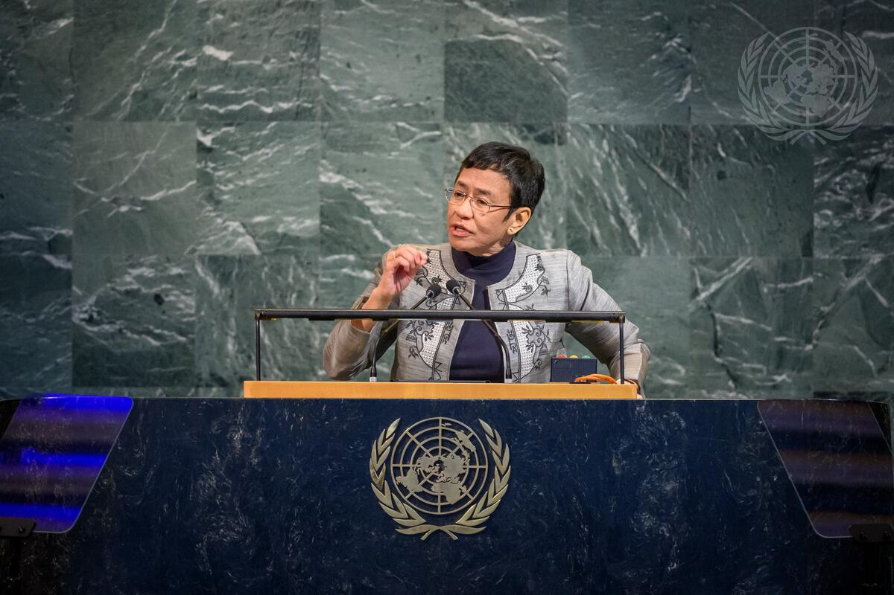
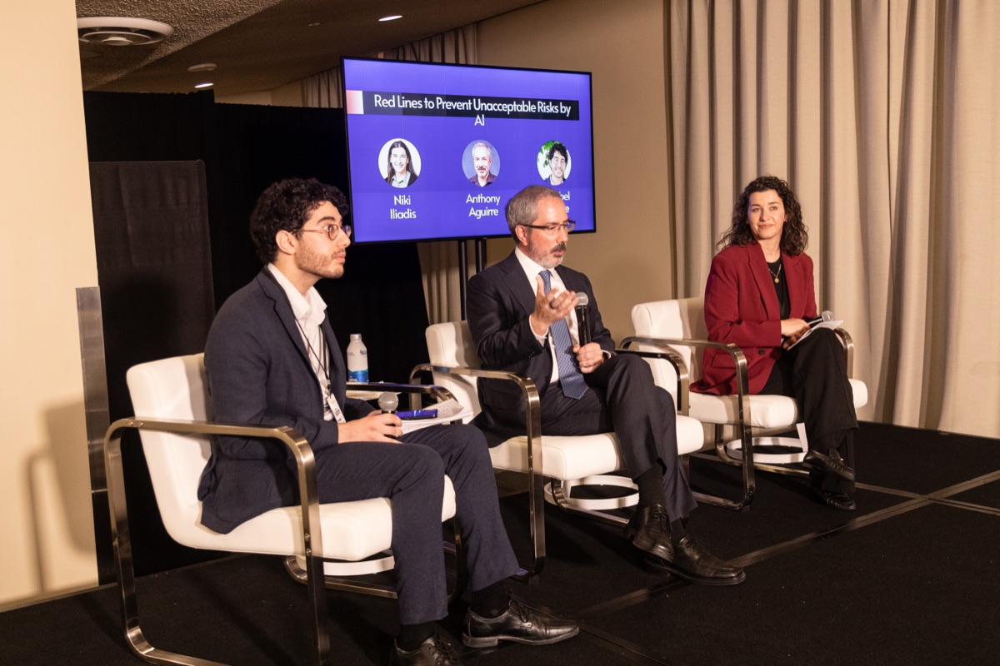
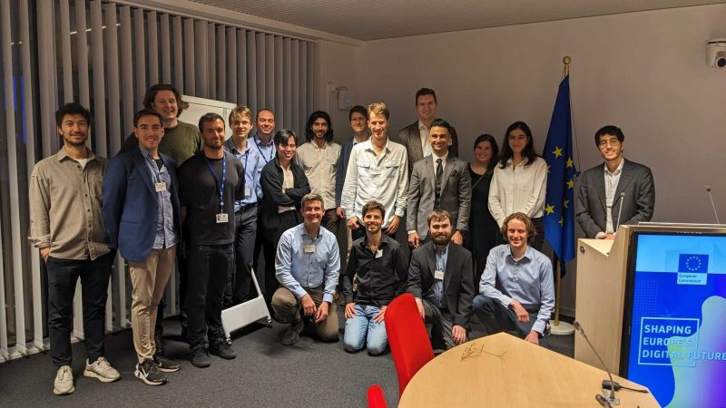
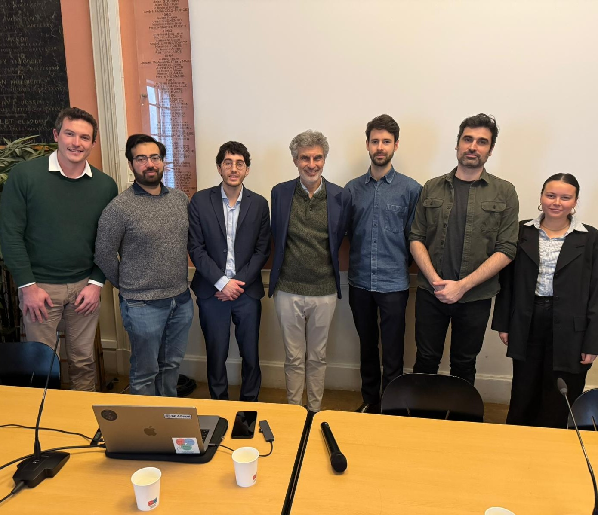
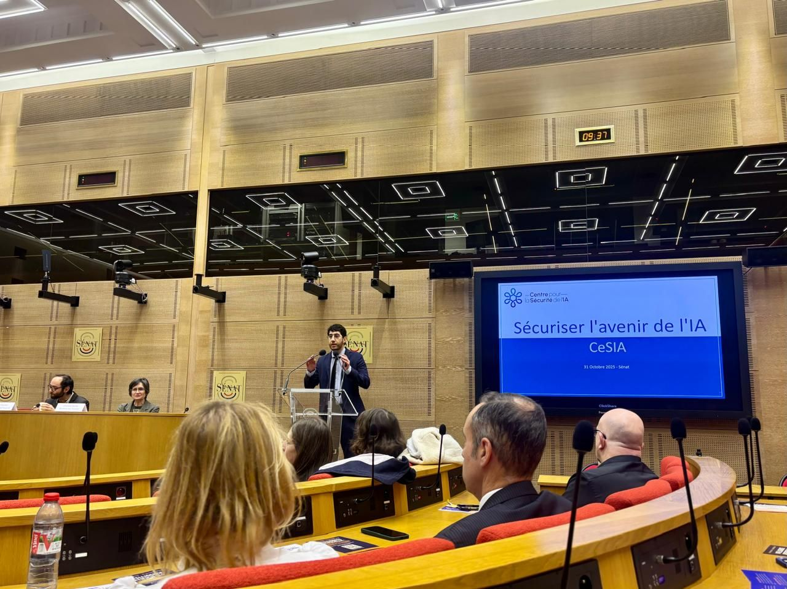
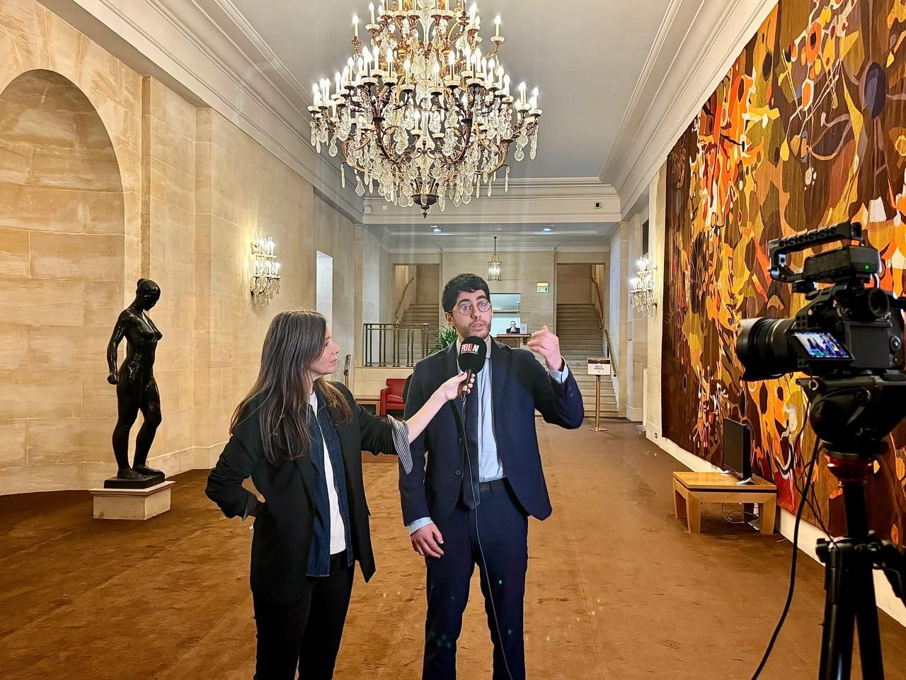
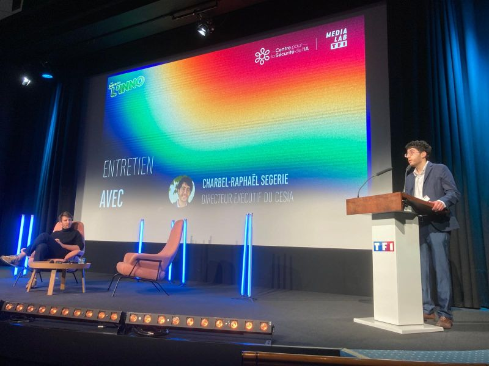
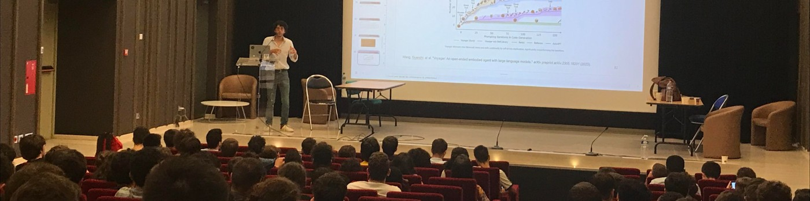
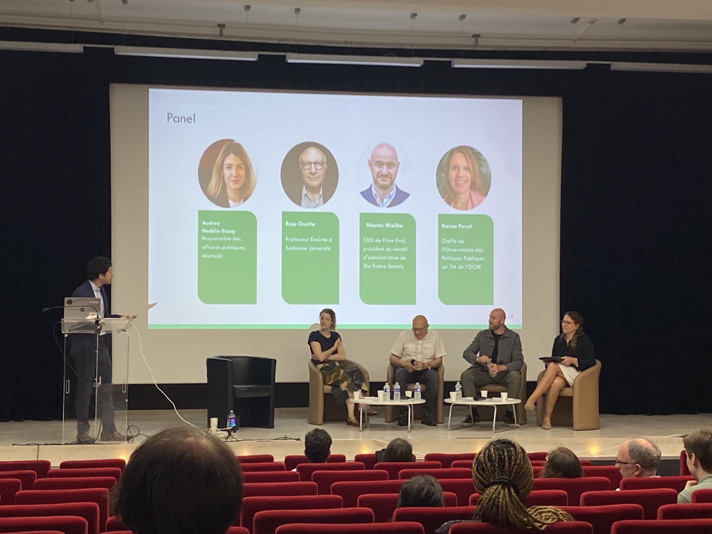

<a href="#policy">Policy & Impact</a> |
<a href="#positions">Positions</a> |
<a href="#publications">Publications</a> |
<a href="#teaching">Teaching</a> |
<a href="#atlas">AI Safety Atlas</a> |
<a href="#projects">Earlier Projects</a>

Policy leader, AI researcher, and institution-builder working at the intersection of technical AI research, international governance, and education. Executive Director of [CeSIA](https://www.securite-ia.fr/), France's leading AI safety organization. Initiator of the [Global Call for AI Red Lines](https://red-lines.ai/) — endorsed by 12 Nobel laureates and presented at the UN General Assembly and Security Council.

[Short bio](/bio) | [CV (PDF)](pdf/CV_Segerie_2026.pdf)

---

## Policy & Impact
{: #policy}

### Global Call for AI Red Lines

I was the initiator and co-lead of the [Global Call for AI Red Lines](https://red-lines.ai/), an international campaign calling for governance mechanisms to prevent catastrophic risks from artificial intelligence. Read more [here](https://www.securite-ia.fr/post/lappel-mondial-a-etablir-des-lignes-rouges).

- **12 Nobel laureate** signatures, 10 former heads of state and ministers, 200+ total signatories
- **300+ media mentions** worldwide (The New York Times, Time, BBC, NBC, Le Monde, AP, AFP)
- Presented at the **UN General Assembly** by Nobel Peace laureate Maria Ressa
- Highlighted by Yoshua Bengio at a **high-level meeting of the UN Security Council**

### EU AI Act — Code of Practice

CeSIA is part of the **official evaluator consortium** for the EU AI Office's Code of Practice for General-Purpose AI (2026–2028), Lot 4: Harmful Manipulation Risks — alongside Apart Research, Transluce & EquiStamp. Contributed to all three rounds of the Code of Practice; recommendations included verbatim in the final draft.

### International Engagements

- **India AI Impact Summit** (Delhi, Feb. 2026) — Convened workshop "Defining and Governing Unacceptable AI Risks" with officials from the EU, Japan, Singapore, Brazil, Denmark, Canada, and UNESCO
- **AI Action Summit** (Paris, Feb. 2025) — Co-organized AI Safety Symposium with keynotes by Y. Bengio and S. Russell; hosted official side-event with GovAI, METR, and the UN; CeSIA cited 11 times in the final consultation report

- **IASEAI Workshop at UNESCO** (Feb. 2026) — Reached consensus on political bottlenecks for AI red lines with international participants and OECD representatives
- **Frontier Safety Frameworks Workshop** — Co-organized with FAR.AI at AW London (Mar. 2026) with representatives from Anthropic, DeepMind, and other frontier labs
- **French Senate** (Palais du Luxembourg) — Presented twice on AI risks and governance, including in front of the French AI Minister
- Published on the **OECD AI Policy Observatory** with Stuart Russell on global AI red lines

### Media & Outreach

Featured or cited in **Le Monde**, **NBC**, **The Verge**, **Les Échos**. Appeared on **TF1** (France's main TV channel), **France Inter** (France's main public radio), and numerous podcasts and YouTube programmes. Collaborated on a YouTube video on AI risks reaching **4 million views**.

---

## Current Positions
{: #positions}

- **Executive Director & Co-Founder**, [CeSIA](https://www.securite-ia.fr/) (Centre pour la Sécurité de l'IA), Paris — Leading a 7-person team across three strategic tracks: France, Europe, and International (2024–present)
- **EU AI Act Code of Practice Evaluator** (via CeSIA), EU AI Office GPAI Code of Practice — Lot 4: Harmful Manipulation Risks (2026–2028)
- **OECD AI Expert**, ONE AI Expert Network (2024–present)
- **Head Teacher**, [Turing Seminar on AGI Safety](https://www.master-mva.com/cours/seminaire-turing/), ENS Paris-Saclay (MVA Master) & ENS Ulm — Created the first university-accredited course on general-purpose AI safety in the EU (2022–present)
- **Founder & Curriculum Designer**, [ML4Good](https://germany.ml4good.org/) — EU Commission-funded programme replicated 20+ times across Europe, Latin America, and beyond; 98% participant recommendation rate; hundreds of alumni now in AI safety careers at EU AI Office, Mistral, MATS, GPAI Policy Lab, and more (2022–present)

---

## Publications
{: #publications}

### Peer-Reviewed & Conference Papers

- Bucknall, Segerie, Bengio et al. (2025). "In Which Areas of Technical AI Safety Could Geopolitical Rivals Cooperate?" **ACM FAccT 2025**.
- Dorn, Variengien, Segerie & Corruble (2024). "BELLS: Benchmarks for the Evaluation of LLM Safeguards." **NextGenAISafety @ ICML 2024**. Included in the OECD catalogue of tools for trustworthy AI.
- Casper, Segerie et al. (2023). "Open Problems and Fundamental Limitations of RLHF." **Transactions on Machine Learning Research (TMLR)**.

### Reports & Preprints

- Martinet, Abecassis, Segerie, Bengio et al. (2025). "A Blueprint for Multinational Advanced AI Development." CeSIA & Oxford Martin AIGI Report.
- Grey & Segerie (2025). "The AI Risk Spectrum: From Dangerous Capabilities to Existential Threats." arXiv:2508.13700.
- Grey & Segerie (2025). "Safety by Measurement: A Systematic Literature Review of AI Safety Evaluation Methods." arXiv:2505.05541.
- Mariaccia, Segerie & Dorn (2025). "The Bitter Lesson of Misuse Detection." arXiv:2507.06282.
- Segerie & Gédéon (2024). "Constructability: Plainly-Coded AGIs May Be Feasible in the Near Future." CeSIA Technical Report.
- Laurençon, Ségerie, Lussange & Gutkin (2024). "Continuous Time Continuous Space Homeostatic RL." ENS / BITS Pilani collaboration.
- Laurençon, Ségerie, Lussange & Gutkin (2021). "Continuous Homeostatic RL for Self-Regulated Agents." arXiv:2109.06580.

### AI Safety Atlas

- Grey, Segerie et al. (2025). [AI Safety Atlas](https://ai-safety-atlas.com/). CeSIA. Used by 1,000+ students worldwide.

### Blog Posts

- Ségerie, C. R. (2023). Against Almost Every Theory of Impact of Interpretability
- Ségerie, C. R. (2023). Davidad's Bold Plan for Alignment: An In-Depth Explanation
- Ségerie, C. R. (2023). Compendium of Problems with RLHF

---

## Teaching
{: #teaching}

**Turing Seminar — AGI Safety** (MVA Master, ENS Paris-Saclay & ENS Ulm): Created the **first university-accredited course on general-purpose AI safety in the EU**, at a time when virtually no European university offered such training. Course available on [YouTube](https://ia.effisciences.org/travaux/playlist-de-conferences-de-la-journee-de-formation-en-surete-de-lia); textbook: the [AI Safety Atlas](https://ai-safety-atlas.com/).

**ML4Good Bootcamps**: Designed the curriculum for the international [ML4Good bootcamps](https://germany.ml4good.org/). The programme has been replicated 20+ times worldwide (France, Germany, Switzerland, Latin America, and beyond). EU Commission-funded. 98% participant recommendation rate.

**Responsible ML**: Contributed to the [Responsible Machine Learning](https://www.master-mva.com/cours/responsible-machine-learning/) course (MVA Master), evaluating student groups on technical AI safety projects.

**MLAB, TA, Berkeley**: TA during the [MLAB](https://www.cbai.ai/ml-bootcamp) — hands-on introduction to state-of-the-art ML techniques (transformers, deep RL, mechanistic interpretability).

---

## AI Safety Atlas
{: #atlas}

Scientific director and co-author of the [AI Safety Atlas](https://ai-safety-atlas.com/) — a comprehensive textbook on AI safety used by 1,000+ students worldwide. The Atlas serves as the course material for the Turing Seminar and ML4Good bootcamps.

---

## Previous Experience

- **Head of the AI Safety Unit**, EffiSciences, Paris (2022–2024) — Led the AI safety division, delivered courses at ENS Paris-Saclay and ENS Ulm, organized hackathons at Collège de France, École 42, Meta, and ENS Ulm, supervised student research on interpretability and AI safety
- **CTO**, [Omniscience](https://github.com/OmniscienceAcademy) (startup), Paris (2021–2022) — Built a search engine for semi-automated literature reviews using NLP and semantic retrieval
- **Research Intern**, Inria Parietal & NeuroSpin (CEA), Saclay (2021) — Machine learning for neuroimaging: EEG/fMRI statistical methods and brain-computer interfaces

---

## Education

- **MVA Master** (Mathematics, Vision, Learning), ENS Paris-Saclay (2020–2021)
- **Engineering Degree**, École Nationale des Ponts et Chaussées (2017–2019)

---

Open Source Software

I've contributed to several open-source projects:

<ul>
<li><a href="https://github.com/EffiSciencesResearch/ML4G">ML4G</a> — Repository containing practical sessions of the AI safety bootcamps. Main developer.</li>
<li><a href="https://github.com/crsegerie/mne-bids-pipeline">mne-bids-pipeline</a> — Template for group EEG studies using MNE Python.</li>
<li><a href="https://github.com/crsegerie/automl">AutoML</a> — Active learning library across different modalities. Main contributor.</li>
</ul>

Earlier Research & Student Projects

<h3><a href="https://github.com/crsegerie/numerical_imaging">SinGAN analysis with PatchMatch algorithm</a></h3>

SinGAN is a generative model that can be learned from a single natural image. We propose a rigorous method to evaluate the image creation capabilities of a GAN using the PatchMatch algorithm.

<h3><a href="https://github.com/crsegerie/modular_neural_networks">A new attention architecture</a></h3>

The human brain combines top-down and bottom-up signals. Bottom-up signals result from direct perception, while top-down signals take into account past experience.

<h3><a href="https://github.com/clement-bonnet/belief-propagation">Graphical Models</a></h3>

Worked on the Belief Propagation algorithm, unifying notations between causal Bayesian graphs and factor graphs.

<h3><a href="https://github.com/crsegerie/bayesian_nearest_neighbors">Bayesian Machine Learning</a></h3>

Worked on the coherence of the nearest neighbor algorithm with Bayesian axioms of probability.

<h3><a href="https://github.com/crsegerie/3D-computer-vision">3D Computer Vision</a></h3>

Reconstructed a face in 3D from two photos.

Neuroimaging Projects

<h3><a href="https://github.com/crsegerie/bci_competition">BCI Competition</a></h3>

A solution to the Inria-BCI competition, ranked 4th in the original competition.

<h3><a href="https://github.com/crsegerie/project_all_resolution_inference">fMRI Statistics</a></h3>

Efficient implementation of <em>All resolution inference for brain imaging</em>.

<h3><a href="https://github.com/crsegerie/welcome_duty">EEG Analysis</a></h3>

MEG signal analysis methodology using the MNE library.

Competitions

<h3><a href="https://github.com/crsegerie/kiro2018">KIRO 2018 — Winner</a></h3>

Winner's solution in partnership with Air France. Iterative solution to the scheduling problem of the Air France aircraft fleet.

<h3><a href="https://github.com/crsegerie/kiroptimiste/tree/master">KIRO 2019 — Winner</a></h3>

Winner's solution for the 5G network optimization competition.

Fun

<h3><a href="https://www.lesswrong.com/posts/Ru2cDrre6D4gkf734/my-intellectual-journey-to-solve-the-hard-problem-of">Consciousness</a></h3>

A blog post claiming to have dissolved the hard problem of consciousness.

<h3><a href="pdf/Biostatistics_Exam_Segerie.pdf">Biostatistics</a></h3>

A critique of the statistical methodology used by two highly cited papers written at the beginning of the Covid epidemic.

<h3></h3>

Boogie-Woogie is great fun to play on the piano, and it's also pretty easy to automate.

<h3><a href="https://omniscience.academy">Gestalt Essay</a></h3>

Using concepts from Gestalt psychology to describe patterns in Escher's birds — in a way the ancestor of neural network interpretability.

---
{: #projects}
